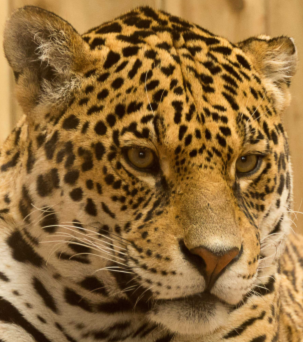
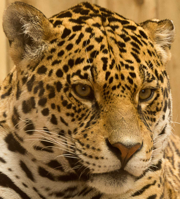
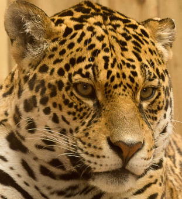
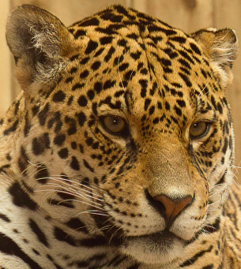

# DLSS-lite

A lightweight DLSS-style upscaler that uses a custom CNN inspired by NVIDIA DLSS, implemented in **PyTorch**.

## Overview

DLSS-lite is designed to boost the visual quality of low-resolution frames using deep learning. It takes input frames from gameplay and produces higher-quality output that approximates the effect of a super-resolution model.

This project aims to provide a **simple, extensible, and easy-to-run** upscaling pipeline suitable for experimentation and training.

---

## Features (to-do)

- Super-resolution upscaling with a custom CNN  
- Fast inference with PyTorch  
- Visual comparisons between original and upscaled images  
- Works on gameplay footage

---

## Current models in Workin progress
 - SimpleSR - 200k params: A five layered convolution neural network for speed rather than fidelity. 
 - ESRGAN - 16.5 million params: A complicated upscaler with heavy 23 Residual-in-Residual Dense Blocks + 19-layer VGG network. Not suited for real-time upscaling [Research article](https://arxiv.org/pdf/1809.00219)

---

## Output

### Gameplay Screenshot Side by Side

|TopLeft=LR (1280x720), TopRight=HR(2560x1440), BottomLeft=SimpleSR, BottomRight=ESRGAN|
|:----------------------------------:|
|  |

---

### Zoomed-In Samples from Training Set (DIV2K)

#### Low Quality vs High Quality

| Low Quality (1020x678) | High Quality (2040x1356) |
|:----------------------:|:------------------------:|
|    |  |

---

#### Upscaled Comparisons (2x)

| SimpleSR (1020x678 -> 2040x1356) | ESRGAN (1020x678 -> 2040x1356) |
|:-------------------------------:|:--------------------------------:|
| |      |


<!-- ## 🛠 Installation

Clone the repository and install dependencies:

```bash
git clone https://github.com/yourusername/dlss-lite.git
cd dlss-lite
pip install -r requirements.txt -->
